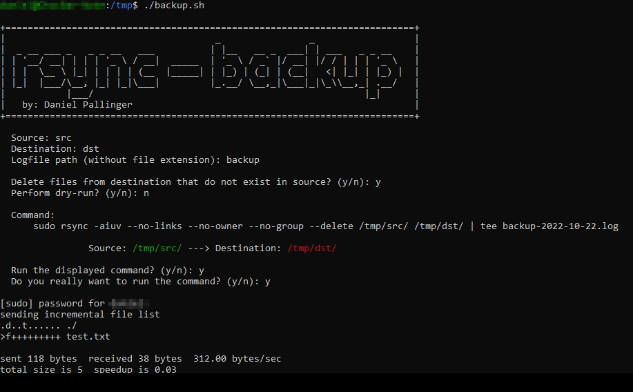

```
                                     _                _
 _ __ ___ _   _ _ __   ___          | |__   __ _  ___| | ___   _ _ __
| '__/ __| | | | '_ \ / __|  _____  | '_ \ / _` |/ __| |/ / | | | '_ \
| |  \__ \ |_| | | | | (__  |_____| | |_) | (_| | (__|   <| |_| | |_) |
|_|  |___/\__, |_| |_|\___|         |_.__/ \__,_|\___|_|\_\\__,_| .__/
          |___/                                                 |_|
     by: Daniel Pallinger
```

The purpose of this simple tool is to make backups or synchronize folders
without having to remember the [command line parameters](https://download.samba.org/pub/rsync/rsync.1) of `rsync`.
By using this script it becomes pretty hard to make mistakes that would result in
loss of data.

**Note:** The script currently can only perform local backups.
By changing the directory input validation the script is able to also perform remote backups.

**Usage:** Just start the script. (It won't do anything until you confirmed twice)

